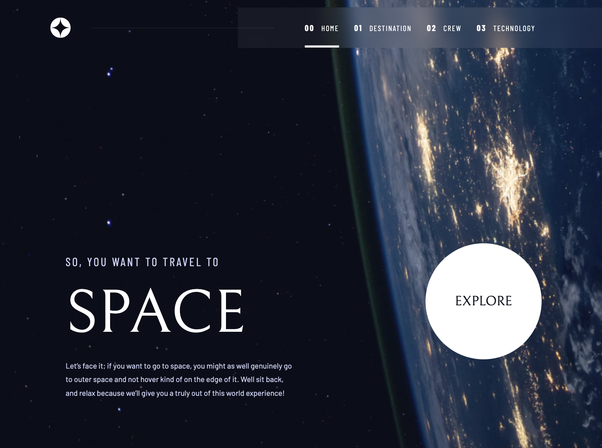
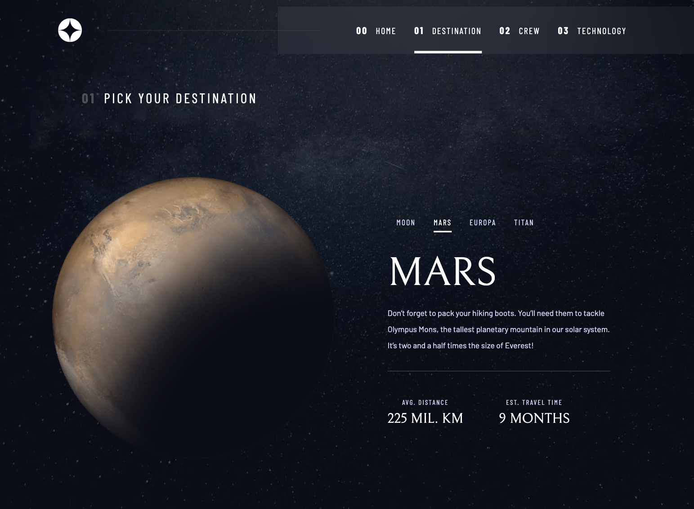

# Frontend Mentor - Space tourism website solution

This is a solution to the [Space tourism website challenge on Frontend Mentor](https://www.frontendmentor.io/challenges/space-tourism-multipage-website-gRWj1URZ3).

### The challenge

Users should be able to:

- View the optimal layout for each of the website's pages depending on their device's screen size
- See hover states for all interactive elements on the page
- View each page and be able to toggle between the tabs to see new information

### Screenshot

### Links

- Solution URL:(https://www.frontendmentor.io/solutions/space-tourism-with-react-woqa6RCSuB)
- Live Site URL: (https://frontend-mentor-space-tourism-three.vercel.app/)

### Built with

- CSS
- Flexbox
- Mobile-first workflow
- [React](https://reactjs.org/) - JS library

### What I learned

- **React State and Props Management:** Learned how to manage dynamic content using state and pass data between components with props.  
- **Conditional Rendering and Keys:** Understood how React re-renders components and the importance of keys for preventing unnecessary DOM updates.  
- **Flexbox and Responsive Design:** Gained experience in building layouts that adapt to mobile, tablet, and desktop screens.  
- **CSS Animations and Transitions:** Implemented fade-in effects and hover animations for smooth UI interactions.  

## Author

- Frontend Mentor - [@tarikdmrts](https://www.frontendmentor.io/profile/tarikdmrts)
